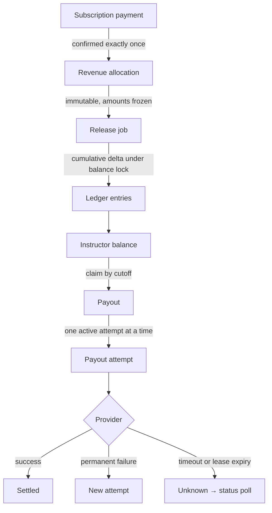

# Architecture

Instructor Revenue Ledger — how subscription money enters the system, becomes
instructor entitlement, and leaves as payouts.

This document covers the decisions the brief deliberately left open, why each was made,
what was rejected, and what it costs.

---

## 1. Vocabulary

Four different quantities in this system are routinely called "earned". They are not
the same number, and conflating them is the most common source of bugs in revenue
systems. The codebase, the schema and this document use these terms and no others.

| Term | Meaning | Definition |
|---|---|---|
| **allocated** | Full-term contractual entitlement, fixed at payment | `revenue_allocations.amount_minor` |
| **recognized** | Net revenue recognized in the ledger | `Σ` **all** entry types (§1.1) |
| **available** | Recognized, unclaimed, payable now — **may be negative** | entries with `payout_id IS NULL` |
| **reserved** | Claimed by a payout that has not reached a terminal state | entries claimed by an in-flight payout |
| **paid** | Claimed by a settled payout | entries claimed by a settled payout |
| **pending** | Recognized economically but not yet posted to the ledger | derived at read time, never payable |
| **watermark** | The instant up to which recognition has been posted | `instructor_balances.recognized_through_at` |

> **allocated ≠ recognized ≠ available ≠ paid.**
> Allocation is a contract. Recognition is time passing. Availability is a claim state.
> Payment is a provider outcome. Each transition is a separate, independently idempotent
> step.

The word *earned* does not appear in the schema or the code.

### 1.1 Three sums, deliberately different

`recognized` and the release job's `posted` are **not** the same aggregate, and the
difference is load-bearing:

| Sum | Includes | Used by |
|---|---|---|
| `recognized` | `release` + `release_correction` + `refund_adjustment` | the balance identity (§12) |
| `posted` | `release` + `release_correction` | the release job's delta (§6.2) |
| level-two reconciliation | `release` + `release_correction` | verified against `Σ released()` |

`posted` excludes `refund_adjustment` because that type records an adjustment that is
**not derivable from `released()`** — a goodwill credit, a chargeback, a manual
correction. Including it would make the release job fight the adjustment:

```
goodwill adjustment −30 posted;  access unchanged, so expected stays 100

posted excludes it  →  100 − 100 = 0     ✓  job leaves it alone
posted includes it  →  100 −  70 = +30   ✗  job silently reverses the refund
```

`recognized` includes all three, because every entry sits in exactly one of the
available / reserved / paid buckets and the identity in §12 must hold over all of them.

---

## 2. The pipeline



Five independently idempotent steps. Each can run twice, crash halfway, or be retried by
a queue worker without changing the outcome.

---

## 3. Money, rates and weights

All amounts are **integer minor units** (piastres). No floats, no decimal division
anywhere in the money path — including rates and split weights, which are the two places
decimals usually creep back in.

| Column | Type | Why |
|---|---|---|
| `subscription_payments.amount_minor` | `BIGINT UNSIGNED` | a payment is never negative |
| `subscription_payments.platform_rate_bps` | `SMALLINT UNSIGNED` | basis points: 20% = `2000`. Never a decimal rate |
| `subscription_payments.platform_cut_minor` | `BIGINT UNSIGNED` | frozen, derived (§5.4) |
| `revenue_allocations.amount_minor` | `BIGINT UNSIGNED` | the canonical entitlement; never negative |
| `revenue_allocations.weight_numerator` / `weight_denominator` | `INT UNSIGNED` | the split rule as an exact rational, for audit (§3.1) |
| `refunds.amount_minor` | `BIGINT UNSIGNED` | magnitude only; direction implied by `kind` |
| `ledger_entries.amount_minor` | `BIGINT SIGNED` | corrections and adjustments are compensating entries |
| `payouts.amount_minor` | `BIGINT UNSIGNED NULL` | null only inside the claim transaction (§10.4) |
| `instructor_balances.available_minor` | `BIGINT SIGNED` | debt is a negative available balance |

### 3.1 What the stored weight is and is not

The weight is stored as an exact rational — a three-way equal split stores `1/3`, never
`0.3333333333` — and the allocator works entirely in integers.

> **The rational weight records the allocation rule for audit and for future allocator
> logic. The frozen `amount_minor` remains the canonical amount to reverse.**

It is worth being precise, because the obvious stronger claim is false. A *full* reversal
does negate exactly under `1/3` with the same tie-break — but only if the magnitude is
rounded and then negated. Rounding the signed value directly gives `floor(−28000/3) =
−9334` three times, overshooting to −28,002. And a *partial* reversal does not preserve
the original skew at all: a fresh largest-remainder pass over a different total has no
reason to hand the extra piastre to the same instructor.

So any reversal — the counter-allocation path in §19 included — splits by the frozen
`amount_minor` proportions, not by re-deriving from weights. The weights earn their place
as the record of *why* an instructor received 9,334, which is what makes an allocator bug
visible, not as arithmetic input.

### 3.2 Currency

**This implementation supports a single settlement currency.** The currency code is
stored on `subscriptions` and `subscription_payments`, where money enters the system.
Downstream tables carry no currency column, because carrying one without conversion
logic, per-currency balances and per-currency payout batching would be decoration rather
than support. Multi-currency is a listed limitation (§19), not a partially-built feature.

### 3.3 Time, and the three timestamps on a ledger row

**All timestamps are stored and compared in UTC.** A recognition boundary that shifts
with a timezone is a boundary that can double-count a day.

A ledger row carries three dates with three distinct jobs:

| Column | Meaning | Driven by |
|---|---|---|
| `period_start` | **when the row was posted** | the release run or the event that created it |
| `recognized_through_at` | **the recognition horizon this row accounts for** | the watermark (§6.2) |
| `effective_at` | **business-effective instant, used for payout eligibility** | the underlying business event |

Every table also has `created_at` — when the row was written. It is **audit only**: it
appears in no calculation and no query filter. The claim predicate uses `effective_at` and
`id` precisely because `created_at` is wall-clock time and not safe to replay against (§10.1).

Worked example — a refund dated 15 March, processed 3 April, watermark at 31 March:

```
period_start           = 2026-04      the posting period
recognized_through_at  = 2026-03-31   unchanged; a correction does not advance time
effective_at           = 2026-03-15   the refund's business date
```

A backdated `effective_at` cannot leak into an already-run batch: replay is bounded by
`id <= max_entry_id` as well as `effective_at <= cutoff_at` (§10.1). That is precisely
why both predicates exist.

The alternative to signed ledger amounts — unsigned plus a `direction` flag — is the
traditional double-entry shape. It was rejected because it turns every aggregate into a
`CASE` expression, and compensating entries are the core of how refunds work here.

---

## 4. Subscription terms

Terms are stored as `[starts_at, ends_at)` — **end exclusive** — and term length is
derived from the dates, never from a plan constant.

```
term_days = ends_at − starts_at      (whole days, UTC)
```

An annual plan starting 2026-01-01 ends 2027-01-01 exclusive: 365 days. Leap years,
31-day months and February need no special-case logic.

This is not cosmetic. The proof in §8 that the platform share can never go negative
depends on the gross and the instructor shares being released against **the same**
elapsed fraction. Hardcoded plan constants make it possible for two code paths to
disagree about the denominator, and the invariant would then fire on a February
subscription for no visible reason. The fraction is computed once per (payment, instant)
and passed to both sides.

---

## 5. Revenue allocation strategy

### 5.1 Money in is confirmed exactly once

The brief asks the system to take payments in as well as pay instructors out. The inbound
side gets the same treatment as the outbound: an external identity, an internal
uniqueness constraint, and a state machine.

```
client_idempotency_key   generated by us, before the call
                         guards: request retried before a reference exists

provider_reference       generated by them, after the call
                         guards: webhook replay, settlement file reprocessed
```

Both are needed because they cover different windows. The first is the inbound mirror of
the `unknown` payout state (§11): we sent a charge request, got a timeout, and cannot
tell whether a payment exists. Without a client-side key there is nothing to query the
provider by and nothing to dedupe against.

```sql
client_idempotency_key  CHAR(36)  NOT NULL  UNIQUE
provider                VARCHAR   NOT NULL
provider_reference      VARCHAR   NULL          -- null until confirmed
UNIQUE(provider, provider_reference)
```

`provider_reference` is nullable and namespaced by provider. References are only
guaranteed unique *within* a provider, so a global constraint would collide the day a
second provider is added.

> **Nullable columns in unique indexes** are used deliberately in three different modes
> here. On `provider_reference` many NULLs are *tolerated*, because uniqueness for
> unconfirmed rows is carried by `client_idempotency_key`. On `ledger_entries.source_ref`
> they are *forbidden*, because uniqueness is the point (§14). On
> `payout_attempts.active_payout_id` they are *exploited*, to express "at most one active
> attempt" (§10.2).

Payment uniqueness does **not** make allocation idempotent — an allocation job retried
against an already-confirmed payment would allocate twice. That is guarded separately:

```sql
UNIQUE(payment_id, instructor_id)  -- on revenue_allocations
```

All allocations for one payment are written in a single transaction so a partial set
cannot exist, and the job is dispatched with `afterCommit()`.

### 5.2 The split rule

**Decision:** equal split across the distinct instructors whose courses the subscription
grants access to, determined at payment time.

The rule sits behind a `RevenueAllocator` interface returning
`[instructorId => [amount_minor, weight_numerator, weight_denominator]]`. Nothing
downstream knows how the split was derived.

**Rejected: consumption-weighted (pro-rata by watch time).** This is what large platforms
actually do and is more commercially realistic. It was rejected for two reasons. First,
it requires inventing and seeding engagement data the brief does not describe, which
means defending a fabricated business rule rather than an engineering decision. Second —
and more interesting — it forces a different recognition model:

> **Recognition timing and split rule are not independent decisions.**
> A consumption-weighted split *cannot* be allocated at payment time, because the basis
> does not exist until the period has elapsed. Equal and enrolment-weighted splits can.
> Choosing equal split is what makes allocate-once-at-payment available.

### 5.3 What is frozen

Snapshotted onto the payment and its allocations, never recomputed:

- `revenue_allocations.amount_minor` — the canonical entitlement
- `revenue_allocations.weight_numerator` / `weight_denominator` — the rule, for audit
- `subscription_payments.platform_rate_bps`, `platform_cut_minor`
- `subscription_payments.instructor_ids` — which instructors share this payment, fixed at
  initiate. The allocation job reads it from the payment, never from its own queue payload,
  so a lost job can be re-dispatched from the database alone. `payments:allocate-missing`
  does exactly that on a schedule: it finds confirmed payments with no allocation rows and
  dispatches the job again. Safe to run any number of times, because of
  `UNIQUE(payment_id, instructor_id)`

Freezing the rate means a later change from 20% to 25% cannot silently rewrite historical
figures — and it is a precondition for §8, where the platform share is *derived* from the
gross. If the rate were read live at release time, reconciliation could not distinguish
drift from a config change.

### 5.4 Platform cut rounding: floor the pool, derive the cut

The platform cut is not computed directly. The **instructor pool** is floored and the cut
is whatever remains:

```
pool = floor(gross × (10_000 − platform_rate_bps) / 10_000)
cut  = gross − pool
```

```
gross 10,001 at 2000 bps   →  pool = floor(8000.8) = 8,000   cut = 2,001
gross 35,000 at 2000 bps   →  pool = 28,000                  cut = 7,000
```

**Direction matters and is deliberate.** The obvious alternative —
`cut = floor(gross × rate / 10_000)`, `pool = gross − cut` — also sums exactly, but hands
the sub-piastre residue to instructors. That would contradict §8, which derives the
platform share as `gross_released − Σ instructor_released` and therefore makes the
platform absorb rounding at *release* time. Flooring the pool means one principle — **the
platform is the residual claimant** — applies at allocation and at release, rather than
each half of the system quietly disagreeing about who absorbs a piastre.

It also preserves what §8's proof needs: `Σ aᵢ == pool ≤ gross`, exactly.

### 5.5 Instructor rounding: largest remainder

Hamilton's method with a deterministic tie-break: floor each share, distribute the
leftover by descending remainder, ties broken by ascending instructor id.

```
gross            35,000
platform cut      7,000   (2000 bps, frozen)
instructor pool  28,000   ÷ 3 = 9333.33…

floors 9,333 × 3 = 27,999    leftover 1    all remainders tie → lowest id wins

instructor  3 → 9,334
instructor  7 → 9,333
instructor 12 → 9,333
                ------
                28,000  ✓
```

Maximum deviation from the exact share is 1 piastre for every participant. The simpler
alternative — floor everyone and give the entire residue to the last party — also sums
correctly and would pass a naive test, but concentrates the whole rounding error on one
instructor.

Largest remainder is always applied to a **magnitude**, never to a signed value.
`floor(−28000/3)` is −9334, and three of those overshoot to −28,002.

Asserted, not assumed: `Σ allocations + platform_cut == payment.amount`, exactly, for
randomised inputs.

---

## 6. Recognition: allocate once, release progressively

**Decision:** one immutable allocation per instructor is written at payment for the full
term amount. That row never changes. What advances over time is how much of it is
*payable*.

```
effective_end  = min(term_end, access_ends_at ?? term_end)
effective_days = effective_end − term_start

elapsed_days(t) = clamp( whole_days(t − term_start), 0, effective_days )
released(t)     = floor( amount × elapsed_days(t) / term_days )
```

**The clamp does both jobs.** Its lower bound stops a timestamp before `term_start`
producing a negative release. Its upper bound makes the cap structural rather than a
separate `min()`: the maximum value of `released` is
`floor(amount × effective_days / term_days)`, which *is* the cap. There is no second
expression to keep in sync.

Worked example — instructor 3, allocated 9,334 over a 90-day term, access terminated on
day 45 (`effective_days = 45`):

| day | raw elapsed | clamped | released |
|---|---|---|---|
| −5 | −5 | 0 | 0 |
| 30 | 30 | 30 | 3,111 |
| 60 | 60 | 45 | 4,667 |
| 90 | 90 | 45 | 4,667 |

Two properties follow:

**No special case at term end.** With no early termination, `effective_days == term_days`,
so at `t ≥ term_end` the clamp yields `term_days` and released is exactly `amount`. The
residue lost to flooring across the term is recovered on the final period.

**The release job cannot pay out refunded money.** An unclamped formula would keep
releasing at day 60 and day 90 and then require compensating entries to undo it. A
negative ledger entry alone does *not* close this hole — the clamp does, by stopping
recognition at source.

### 6.1 Access termination is not cancellation, and not every refund

The trigger for the cap is `access_ends_at`, deliberately distinct from both
`cancelled_at` and the existence of a refund:

| Event | Access | Recognition cap | Ledger effect |
|---|---|---|---|
| Cancels auto-renew, term continues | unchanged | **none** | none |
| Terminated mid-term, prorata refund | ends at refund date | `access_ends_at = refund date` | correction if already over-recognized |
| Terminated mid-term, full refund | ends | `access_ends_at = starts_at` → `effective_days = 0` | correction claws back everything |
| Goodwill partial refund, access continues | unchanged | **none** | `refund_adjustment` / counter-allocation *(§19)* |

Setting `access_ends_at = starts_at` makes a full refund fall out of the existing clamp
with no new code. Only the goodwill case needs a new mechanism, because it reduces
entitlement without reducing access — and that is precisely why `refund_adjustment` is
excluded from `posted` (§1.1).

`refunds` is a first-class event table (§14). Whether a given refund sets `access_ends_at`
is a business rule applied by a policy class, not assumed by the ledger, and each `kind`
has its own test.

A refund event dispatches a **targeted recompute** for the affected instructors rather
than waiting for the next monthly release run. Otherwise a payout could go out in a window
where the refund exists but the corresponding correction is not yet in the ledger.

### 6.2 The release job: cumulative delta, serialised, monotonic

The ledger is aggregated per instructor (§6.4), so the job must be too. Tracking a posted
amount *per allocation* would require exactly the hidden per-allocation ledger state the
aggregation decision exists to avoid.

```
W           = instructor_balances.recognized_through_at            -- the watermark
expected(t) = Σ over all that instructor's allocations of released(alloc, t)
posted      = Σ of that instructor's release + release_correction entries   (§1.1)
delta       = expected(t) − posted
```

**Two callers, one formula, differing only in what `t` is:**

| Caller | `t` | Watermark |
|---|---|---|
| **Scheduled release** for target `T` | `T` | advances `W → T`; **no-op if `T ≤ W`** |
| **Event correction** (refund, termination) | `W` | held; the row records `recognized_through_at = W` |

```
delta > 0   → post  release             (+delta)
delta < 0   → post  release_correction  (−delta)
delta == 0  → post nothing
```

**The implementation contract.** Like every other money-moving transaction, the release
job acquires the instructor's serialisation point first (§9.4) — the lock is what makes
the `posted` read safe, so it is part of the contract rather than an optimisation:

```
TRANSACTION
    SELECT * FROM instructor_balances WHERE instructor_id = :iid FOR UPDATE

    W = recognized_through_at
    scheduled run and T <= W  →  COMMIT, post nothing        (Hazard B)

    posted = Σ (release + release_correction) for this instructor     (§1.1)
    delta  = expected(t) − posted

    delta != 0  →  INSERT ledger entry (release | release_correction)
                     source_ref = 'period:…' | 'refund:…'
                     recognized_through_at = t

    UPDATE instructor_balances
       SET recognized_minor = recognized_minor + delta,
           available_minor  = available_minor  + delta,
           recognized_through_at = :t          -- scheduled runs only
     WHERE instructor_id = :iid
COMMIT
```

Both the `posted` read and the watermark read happen under the lock, which is what
Hazard A below requires. The job is chunked by instructor and holds one such lock at a
time, so the cost is per-instructor and short (§17).

**Two distinct hazards, two distinct mechanisms.** They are easy to conflate and neither
one covers the other.

*Hazard A — concurrent runs with different targets.* Under `REPEATABLE READ`, two
transactions started before either commits both read `posted` from their own snapshot:

```
W = February.   Worker A target March, Worker B target April.
A reads posted = 0,  expected(Mar) = 100,  posts +100
B reads posted = 0,  expected(Apr) = 200,  posts +200
ledger = 300,  but expected(Apr) = 200.    Over-recognized by 100.
```

`UNIQUE(instructor_id, type, source_ref)` does not help: `period:2026-03` and
`period:2026-04` are different keys. The fix is the serialisation rule in §9.4 — the
release transaction takes the `instructor_balances` row `FOR UPDATE` before reading
`posted`, so B blocks, then reads `posted = 100` under the lock.

*Hazard B — a missed run executing late.* Cumulative delta is self-healing, but without a
guard the late run corrupts the catch-up:

```
March missed.  April runs: expected(Apr 30) = 200, posted = 0,   delta = +200   ✓
March runs late (unguarded): expected(Mar 31) = 100, posted = 200, delta = −100  ✗
```

So a scheduled release may only **advance** the watermark; a run for a target already
covered is a no-op. With both mechanisms in place the late March run reads `posted = 200`
under the lock *and* is stopped by `T ≤ W` — each would catch it alone, and the
belt-and-braces is by construction rather than luck.

**The guard applies only to scheduled runs.** Event corrections legitimately move the
cumulative total backward — that is their purpose — and they do so without touching the
watermark, so a refund's delta is purely the effect of the cap change and never
contaminated by elapsed time.

*Example.* Day-30 release posts 3,111, watermark at day 30. A termination dated day 29
arrives; `effective_days` becomes 29, so `released(day 30) = floor(9334 × 29/90) = 3,007`:

```
expected(W) = 3,007      posted = 3,111      delta = −104   →   release_correction −104
watermark unchanged at day 30
```

If that 3,111 was already claimed by a settled payout, the correction drives `available`
negative and nets against future recognition (§10.4). No new mechanism is required:
**release correction and refund adjustment are the same operation**, one triggered by a
time advance, the other by an event.

A correction firing before any release exists sees `expected = 0, posted = 0, delta = 0` —
correct, since nothing was recognized to correct.

**Idempotency of the run.** The scheduled run keys its row on the posting period
(`period:2026-03`), so re-running a month is a no-op by constraint *and* by the watermark
guard. Every event-driven correction is keyed on the *event* (`refund:9812`), never on the
period — otherwise a refund landing between two runs of the same month would compute a
nonzero delta it could not insert.

### 6.3 `period_start` is a posting period, not a recognition period

Cumulative delta has a direct consequence on what a ledger row means. If March's run is
missed, April's row carries March's recognition too:

```
April:  expected 200,  posted 0,  row = +200   ← posted in April, recognized across March–April
```

This is not a correctness problem, but it makes an unqualified reading of `period_start`
wrong. So the semantics are stated rather than assumed (§3.3): `period_start` is when the
row was posted; `recognized_through_at` is the horizon it accounts for. Consecutive
`recognized_through_at` values give the span each posting covered.

**Rejected:** posting one catch-up row per missed period, which would preserve
recognition-period semantics. It costs the self-healing property — per-period expected
computation plus an explicit backfill path — to buy a label.

### 6.4 Granularity, and what it costs

Recognition is computed daily but **posted monthly, aggregated per (instructor, posting
period)** — not per allocation. At the stated scale this is the difference between a few
thousand ledger rows per cycle and tens of millions. The job is a grouped aggregate over
allocations chunked by instructor, not a per-row loop.

The cost is real and accepted deliberately:

> The ledger cannot answer *"which subscription paid for this"*. Per-subscription
> attribution lives in `revenue_allocations`, which is immutable and joinable back to the
> payment. The ledger deliberately does not duplicate it.

### 6.5 What "outstanding" means

The brief requires the system to answer, at any moment, how much is owed, paid and
outstanding. That question has no answer until the term is defined, because recognition is
continuous and posting is periodic.

**Outstanding means recognized, posted, and unclaimed.** It is the number a payout
consumes, it is backed by ledger rows, and it is the only authoritative figure. It may be
negative.

The economically-accrued-but-unposted amount is still useful — it is what an instructor
means when they look at a screen — so it is computed as a derived read, labelled
**pending**, and never touched by a payout:

```
Available (payable now)        4,667
Pending (accrued, unposted)      933      = Σ released(alloc, now) − posted
Paid to date                   3,111
```

Only one number can be authoritative, and it must be the one the payout process claims
against. A live-computed figure cannot be reconciled, because it is a function rather than
a record.

---

## 7. Refunds

Two mechanisms, and the distinction is the most useful property of this design.

**Unearned money → stop future recognition.** No compensating entry. `access_ends_at`
shortens `effective_days` and the money simply never becomes payable. In the worked
example, instructor 3 keeps 4,667 and is never owed the remaining 4,667. **There is no
clawback in the common case** — a student leaving mid-term does not create a debt for an
instructor who did nothing wrong. This is the entire payoff of §6.

**Already-recognized money → compensating entry.** A negative ledger row against the frozen
`amount_minor` proportions of the original allocation. If the money was already paid out,
`available` goes negative and nets against future recognition automatically (§10.4).

### 7.1 The refund formula is an assumption, stated

> **For this implementation, a prorated termination refund is assumed to correspond to the
> unused portion of the subscription term.** Terminating access at the refund date is taken
> to be the correct representation of the student's remaining financial entitlement. The
> brief requires sensible treatment of mid-term refunds; it does not mandate this formula,
> and a different business rule would change `access_ends_at`, not the machinery around it.

A consequence worth stating rather than discovering: **when a refund exceeds the unearned
portion, the excess comes entirely out of the platform share.** Instructor recognition is
capped by access, not by the refund amount, so refunding 200 where 175 is unearned costs
the platform the extra 25. That is correct — the platform is the residual claimant (§8) —
but only defensible because it was intended.

### 7.2 The case with no clean answer

A refund arriving after that period's payout has already settled. The money is gone. All
the system can do is record the negative entry and net it against future recognition, with
a manual write-off path if the instructor never recognizes revenue again. This is a race
against the real world, not a design flaw that can be engineered away.

A **hold period** (paying period P during P+1) shrinks the window. Not implemented; the
cost is instructor cash flow, and the trade-off is a business decision rather than a
technical one.

---

## 8. The platform is the residual claimant

At allocation, the pool is floored and the platform takes the remainder (§5.4). At release,
the same principle applies:

```
gross_released(t)    = floor( gross × elapsed_days(t) / term_days )
platform_released(t) = gross_released(t) − Σ instructor_released(t)
```

Day 45 of the worked example: `17,500 − (4,667 + 4,666 + 4,666) = 3,501`.
Day 90 with no early termination: `35,000 − 28,000 = 7,000`.

This dissolves the rounding-residue problem instead of documenting it as a limitation.
`platform_released ≥ 0` is asserted as an invariant, and the proof is worth stating because
what it really documents is why §5.4, §5.5 and this section are coupled:

```
Let f = elapsed_days(t)/term_days, identical on both sides
(same term, same access_ends_at, same clamp).

Σᵢ floor(aᵢ·f)  ≤  Σᵢ aᵢ·f  =  (Σᵢ aᵢ)·f  =  pool·f  ≤  gross·f

Σ instructor_released is an integer and ≤ gross·f, and floor(gross·f) is the
largest integer ≤ gross·f.

∴  Σᵢ floor(aᵢ·f)  ≤  floor(gross·f)  =  gross_released                    ∎
```

Flooring is applied once on the gross and N times on the instructor shares, so "both sides
use the same formula" is not sufficient on its own. The proof holds only because of three
things that are easy to break accidentally:

1. `Σ aᵢ == pool` **exactly** — guaranteed by largest remainder (§5.5).
2. `pool ≤ gross` — guaranteed by flooring the pool rather than the cut (§5.4).
3. Both sides use the **same** clamped `f`. Denormalise `access_ends_at` onto allocations
   and let it drift from the subscription, and this collapses.

---

## 9. Concurrency and idempotency

### 9.1 Constraints are correctness; locks are throughput

| Constraint | Guards against |
|---|---|
| `UNIQUE(client_idempotency_key)` on payments | charge request retried before a reference exists |
| `UNIQUE(provider, provider_reference)` on payments | webhook replay, settlement reprocessing |
| `UNIQUE(provider, provider_reference)` on refunds | refund webhook replay |
| `UNIQUE(payment_id, instructor_id)` on allocations | allocation job retried after a crash |
| `UNIQUE(instructor_id, type, source_ref)` on ledger entries | release run twice, refund processed twice |
| `UNIQUE(batch_id, instructor_id)` on payouts | payout command run twice, two servers at once |
| `UNIQUE(idempotency_key)` on attempts | queued job retried mid-flight |
| `UNIQUE(payout_id, attempt_no)` on attempts | two workers creating attempt #2 concurrently |
| `UNIQUE(active_payout_id)` on attempts | two attempts in flight for one payout (§10.2) |

Every key is derived deterministically — `hash(payout_id, attempt_no)`, `period:2026-03`,
`refund:9812` — so a re-run produces the *same* key and the insert simply fails rather than
creating a duplicate.

`Cache::lock()` on the Artisan command and `ShouldBeUnique` on jobs prevent wasted work,
but both are Redis-backed and can expire mid-operation.

> **The Redis lock is an optimisation. The constraint and the database row lock are the
> guarantees.**

### 9.2 Laravel-specific integrity

- Jobs are dispatched with `->afterCommit()`. Without it a worker can pick up a job before
  the row it depends on is visible.
- `DB::transaction()` retries its closure on deadlock, so **any** side effect inside it — a
  dispatch, an HTTP call, an event — can fire twice. Transaction closures are kept pure:
  reads and writes only.

### 9.3 Ownership is decided by affected-row count

The ledger claim is the clearest instance. A single conditional statement decides who owns
the rows, and the loser learns it from the affected-row count:

```php
$claimed = LedgerEntry::where('instructor_id', $instructorId)
    ->whereNull('payout_id')
    ->whereIn('type', ['release', 'release_correction', 'refund_adjustment'])
    ->where('id', '<=', $batch->max_entry_id)
    ->where('effective_at', '<=', $batch->cutoff_at)
    ->update(['payout_id' => $payout->id]);

if ($claimed === 0) {
    return; // nothing eligible, or another worker took them
}
```

> Ownership is decided either by a conditional `UPDATE` and its affected-row count, or —
> where a decision depends on rows in a **second table** — by taking the serialising row
> lock first and reading under it (§9.4).

Reads still happen: the claimed sum in §10.4, the active-attempt check in §10.2, and
`posted` in §6.2 are all read-then-write. Each occurs inside a transaction that already
holds the relevant row lock. That is the distinction that matters — not the absence of
reads, but the absence of an *unlocked* read that a write depends on.

### 9.4 One serialisation point per instructor

A conditional `UPDATE` cannot express a decision that depends on another table, and
`REPEATABLE READ` snapshots make unlocked cross-table reads unsafe (§6.2, Hazard A).
Different jobs also touch `instructor_balances` and `ledger_entries` in opposite orders,
which is a deadlock waiting to happen. One rule resolves both:

> **The `instructor_balances` row is the per-instructor serialisation point. Every
> money-moving transaction acquires it `FOR UPDATE` before reading or writing that
> instructor's ledger entries, payouts or attempts.**

```
release job      lock balance → read posted → post delta → update balance + watermark
payout claim     lock balance → claim entries → sum → insert payout → update balance
settlement       lock balance → lock payout → resolve attempt → update balance
failure          lock balance → lock payout → check attempts → un-stamp → update balance
```

**Allocation is outside this rule.** It writes only `revenue_allocations`, and every value it
reads — the payment's amount, rate and instructor set — is frozen and never changes. There is
no unlocked read that a write depends on, so there is nothing to serialise;
`UNIQUE(payment_id, instructor_id)` is the whole guard. What allocation *does* do is make
sure each instructor has a balance row, using an insert-if-missing in ascending
`instructor_id` order (ascending, so two allocations can never deadlock on each other). The
release job's `FOR UPDATE` needs that row to exist — a lock on a missing row locks nothing.

Contention is per-instructor and the critical sections are short, so this costs nothing at
the stated scale — the release job is chunked by instructor and never holds more than one
such lock at a time. Batch-level reads that only decide *which* instructors to dispatch
take no lock; they are an optimisation, not a decision about money.

---

## 10. Payout architecture

### 10.1 The claim is the concurrency control

```sql
UPDATE ledger_entries
   SET payout_id = :payoutId
 WHERE instructor_id = :instructorId
   AND payout_id IS NULL
   AND type IN ('release', 'release_correction', 'refund_adjustment')
   AND id           <= :maxEntryId
   AND effective_at <= :cutoffAt;
```

**The type allowlist is deliberate.** Today every type in the table is payable, so the
clause is a no-op — which is exactly why it must be written now. A future
`tax_withholding`, `audit_note` or `accrual_memo` added by someone who has never read this
document would otherwise become payable by default. In a money-moving query, enumerate what
may be paid rather than assuming the table contains nothing else.

**Both range predicates are load-bearing.** `effective_at` is business-time eligibility.
`max_entry_id` is frozen at batch creation and is what makes the batch a genuine snapshot:

```
10:00   batch N created, max_entry_id = 5000, cutoff_at = 10:00
10:05   late refund arrives:  id = 5001,  effective_at = 09:00   (backdated, §3.3)
```

Replaying batch N later with `effective_at <= 10:00` alone would sweep that entry into an
old batch and produce a different result than the original run. With `id <= 5000` it cannot.
The entry is not lost — it satisfies both predicates for batch N+1.

### 10.2 A payout is not an attempt

```
payout           pending → in_progress → settled | failed | needs_review
payout_attempt   sending → succeeded | failed | unknown → succeeded | failed | unresolved
                                                   unresolved → succeeded | failed  (§11.2)
```

There is **no `pending` attempt state**. An attempt row is created already in `sending`,
inside the same transaction that acquires the slot, so no attempt can exist without a worker
having committed to calling the provider. This removes an entire class of stuck row that
would otherwise block the payout and fall outside the lease sweeper.

**Acquiring the slot and the attempt number.** The property that must hold is:

> `attempt_count` increments **if and only if** the worker acquires the slot.

A condition on the payout's own status alone does not give this. `in_progress` satisfies
such a predicate for *both* workers, so a second worker increments the counter and only then
discovers, via `UNIQUE(active_payout_id)`, that it cannot insert — which makes the
constraint the mechanism and the gate the backstop, the inverse of what is wanted.

The slot depends on rows in a second table, so §9.4 applies:

```
TRANSACTION
    SELECT * FROM instructor_balances WHERE instructor_id = :iid FOR UPDATE
    SELECT * FROM payouts             WHERE id = :id           FOR UPDATE

    abort unless  status IN ('pending', 'in_progress')
             and  attempt_count < :ceiling
             and  no attempt for this payout in ('sending', 'unknown')

    UPDATE payouts SET status = 'in_progress', attempt_count = attempt_count + 1
     WHERE id = :id

    n = attempt_count
    INSERT attempt (attempt_no = n, idempotency_key = hash(payout_id, n),
                    status = 'sending', lease_expires_at = now + lease)
COMMIT
```

Worker B blocks on the locks until A commits, then reads `payout_attempts` under them as a
current read and sees A's active attempt. It aborts without touching the counter.

**Why not a single statement with a `NOT EXISTS` subquery.** It is equivalent *if* InnoDB
evaluates that subquery as a locking read. Whether it does depends on isolation level and
version; against the transaction's snapshot, B may not see A's insert and the gate passes
anyway. The explicit lock is correct under any configuration, and the money path should not
depend on semantics that need looking up.

The ceiling belongs in this gate, not only in the sweeper (§10.7) — otherwise the gate can
hand out an attempt the sweeper would have refused. Excluding `needs_review` means a
human-flagged payout cannot be silently retried by a worker.

**The loser exits.** A worker that loses the race must not fall through to attempt #3 — the
winner is sending #2 right now. One attempt in flight at a time is the rule, and the database
enforces it even if the gate is bypassed:

```sql
active_payout_id BIGINT GENERATED ALWAYS AS (
    CASE WHEN status IN ('sending','unknown') THEN payout_id END
) STORED,
UNIQUE(active_payout_id)
```

**Rejected:** an `attempts` counter alone with the key derived from it and no attempt table.
Cheaper and still unique per attempt, but it loses the per-attempt provider request and
response — the evidence trail when somebody asks what happened on a given date.

### 10.3 Claim inside a transaction, call the provider outside it

```
TRANSACTION
    lock instructor_balances row                         (§9.4)
    insert payout (pending, amount NULL)
    claim ledger entries → payout_id
    decide on the claimed sum (§10.4)
    update balance cache (§10.5)
COMMIT
--- then, and only then ---
    acquire slot + create attempt (§10.2), call provider
```

A database lock is never held across a network call. Doing so makes the payout table
serialise on a third party's tail latency.

### 10.4 A non-positive claim produces no payout at all

A claimed set can contain both releases and negative corrections, so the sum is not
necessarily positive. The sign is checked **after** the claim, because the entries are
already stamped by the time the sum is known — and the whole transaction is rolled back if
it is not positive:

```
TRANSACTION
    lock instructor_balances row
    insert payout (status = pending, amount_minor = NULL)
    claim entries → payout_id
    sum = SUM(claimed)

    sum <= 0   →  ROLLBACK        no payout row, entries stay unclaimed
    sum >  0   →  UPDATE payouts SET amount_minor = sum;  update cache;  COMMIT
```

**Why `amount_minor` is nullable.** The payout id must exist before the entries can be
stamped with it, but the amount is not known until after the claim. `CHECK (amount_minor >
0)` on a `NOT NULL` column makes that impossible to express, so the column is nullable and
the constraint permits the intermediate:

```sql
amount_minor BIGINT UNSIGNED NULL
CHECK (amount_minor IS NULL OR amount_minor > 0)
```

MySQL has no deferred constraints, so "never commits as NULL" is guaranteed by the
transaction structure, not by the database. A status-conditional CHECK does not work here:
`pending` with a known positive amount is a **legitimate committed state**, because §10.3
commits the claim while §10.2 only moves the payout to `in_progress` later.

**Rejected, though arguably better:** a client-generated id (ULID) lets the entries be
stamped first and the payout row inserted **last**, already carrying its final amount — no
NULL state at any point. It requires giving up auto-increment primary keys on that table,
which is a larger decision than this fix warrants.

**Debt is not a payout.** A negative balance lives as unclaimed negative ledger entries,
exactly where a positive balance lives:

```
Mar   release +100, correction −150      available  −50
      claim both, sum −50, ROLLBACK      no payout, no transfer

Apr   release +200                       available +150
      claim all three, sum +150          transfer 150
```

The netting is automatic: the claim query takes *every* unclaimed payable entry, so the March
debt is swept up by the April batch with no carry-forward mechanism. The bucket identity in
§12 is untouched, because nothing ever sits in a terminal-but-unresolved claim state.

**Optimisation, not correctness:** the command dispatches jobs only for instructors with
`available_minor > 0`. The transaction is the guarantee; the filter avoids pointless work.

### 10.5 The balance cache is maintained by the transaction, not by reconciliation

Reconciliation (§12) exists to *detect* drift, not to repair it. Every state transition
updates the cache in the same transaction that moves the ledger rows:

| Transition | Cache effect |
|---|---|
| Any recognition entry posted — `release`, `release_correction` or `refund_adjustment` | `recognized += delta`, `available += delta` |
| Scheduled release advances the horizon | also `recognized_through_at = T` |
| Claim committed | `available −= amount`, `reserved += amount` |
| Payout settled | `reserved −= amount`, `paid += amount` |
| Payout failed, entries released | `reserved −= amount`, `available += amount` |
| Claim rolled back (§10.4) | none — the whole transaction is discarded |

Every update is `SET col = col + ?`, never a read-modify-write in PHP. `recognized` moves on
**every** recognition type, not only `release` — see §1.1, where `recognized` and `posted`
are deliberately different sums. Claiming and settling redistribute money between the three
sub-buckets without changing `recognized`, which is exactly what §12 asserts.

### 10.6 Each terminal transition is exactly one transaction

Money moves between buckets in three places, and each must commit as a unit:

```
claim      available → reserved      §10.3
success    reserved  → paid          below
failure    reserved  → available     below
```

Split any of them across two commits and a crash in between leaves entries in no bucket at
all — a direct violation of §12.

**Settlement.**

```
TRANSACTION
    lock instructor_balances, lock payout                         (§9.4)

    UPDATE payout_attempts SET status = 'succeeded', provider_reference = :ref
     WHERE id = :attemptId AND status IN ('sending', 'unknown', 'unresolved')

    affected = UPDATE payouts SET status = 'settled', settled_at = NOW()
                WHERE id = :payoutId AND status IN ('in_progress', 'needs_review')

    if affected == 0  →  see "late success" below
    update balance cache  (reserved −= amount, paid += amount)
COMMIT
```

**Failure — with preconditions on attempt state.**

```
TRANSACTION
    lock instructor_balances, lock payout

    abort unless  no attempt for this payout in ('sending', 'unknown')
             and  no attempt for this payout in ('succeeded')

    affected = UPDATE payouts SET status = 'failed'
                WHERE id = :payoutId AND status IN ('in_progress', 'needs_review')

    if affected == 0  →  someone else resolved it; COMMIT and move no money

    UPDATE ledger_entries SET payout_id = NULL WHERE payout_id = :payoutId
    update balance cache  (reserved −= amount, available += amount)
COMMIT
```

**The attempt precondition is the fix for a real money bug.** Without it, a payout could be
failed — manually or by an exhausted retry ceiling — while an attempt was still `unknown` and
polling. The later poll would then set that attempt `succeeded` while the payout was already
`failed` and its entries released back to `available`: the provider moved the money and the
system believes it did not.

**The balance update is the one without a natural guard**, so both transactions gate it on
the payout transition's affected-row count. Three individually conditional statements are not
automatically safe together: a replayed settlement would find `status = 'settled'`, affect
zero rows on the payout, and then still move `reserved → paid` a second time if the cache
update ran unconditionally.

The ledger un-stamp *is* naturally idempotent (`WHERE payout_id = :id`), so a transaction
retried after a deadlock is safe.

**Late success on an already-failed payout.** The precondition narrows this window but cannot
close it — see §11.3. If settlement finds the payout `failed`, it must **not** move money
(the entries may already belong to another payout). It records the attempt as `succeeded`,
writes a `reconciliation_alert`, and pages a human. This is the one path in the design that
is knowingly unrecoverable by machine, and it is listed as such in §19.

### 10.7 Stranded payouts are re-dispatched

A payout can be committed with its entries claimed and then have its attempt-creation job
lost — the queue dropped it, the worker died before the §10.2 transaction, the dispatch never
landed. It would sit in `pending` forever with money reserved and nothing sweeping it. The
same is true of an `in_progress` payout whose only attempt failed terminally and whose retry
dispatch vanished.

One sweeper covers both:

> A payout in **`pending` or `in_progress`** with **no active attempt** and `attempt_count`
> below the ceiling is re-dispatched. Above the ceiling it moves to `failed` via §10.6.
> **`needs_review` is never re-dispatched** and requires explicit human resolution.

The exclusion is not a detail. `needs_review` is **non-terminal for money** — its entries stay
reserved until a human resolves it, which is why §12 counts them in the reserved bucket — but
**terminal for automation**: no worker may act on it. Any sweeper predicate written as
"non-terminal" rather than an explicit status list would silently undo the §10.2 rule that a
human-flagged payout is never retried by a machine.

Within that scope the sweep is unconditionally safe: the absence of an active attempt —
enforced by `UNIQUE(active_payout_id)` — means nothing is in flight with the provider, so
creating the next attempt cannot double-send.

---

## 11. Provider timeout and worker-crash handling

**A timeout is not a failure**, and **neither is a crash after dispatch**. Both collapse into
the same uncertainty, and the design gives that uncertainty a name rather than guessing.

```
sending → { succeeded | failed | unknown }
             ▲
             │ lease expiry
unknown → { succeeded | failed | unresolved }        via status query only
unresolved → { succeeded | failed }                  via late poll or human evidence
```

### 11.1 The recovery boundary is a commit, not an HTTP call

```
TRANSACTION
    acquire slot, insert attempt (status = sending, lease_expires_at = now + lease)
COMMIT                                     ←  the boundary
    call provider
TRANSACTION
    record outcome  WHERE status IN ('sending', 'unknown', 'unresolved')
COMMIT
```

- **Crash before the first commit** — no attempt row exists and `attempt_count` was not
  incremented, because both are in the same transaction. §10.7 re-dispatches.
- **Crash after it** — the attempt sits in `sending` with the provider possibly holding money
  in flight. A queue retry cannot create a second attempt (`UNIQUE(active_payout_id)`), so
  without recovery it would stay there forever.

A sweeper resolves it:

```sql
UPDATE payout_attempts
   SET status = 'unknown'
 WHERE status = 'sending'
   AND lease_expires_at < NOW();
```

The sweeper's **only** legal transition is `sending → unknown`. It never marks an attempt
failed and never resends. From `unknown`, the normal status-polling path applies — and
because `unknown` is still non-terminal, `active_payout_id` keeps a second attempt from being
created underneath it.

This is deliberately conservative. A worker that died in the microsecond *between* the commit
and the HTTP call sent nothing, but the system cannot know that, so it waits out the lease and
asks the provider rather than assuming. The cost is latency on a rare path; the alternative is
guessing about money.

### 11.2 `unresolved` is not the end of the conversation

When polling exhausts its backoff the attempt becomes `unresolved` and the payout moves to
`needs_review` — money still claimed, a human alerted, **never auto-released**.

`unresolved` means *the provider has not told us yet*, not *it failed*. So the outcome
predicate includes it: `status IN ('sending','unknown','unresolved')`. A definitive answer
arriving a day later — from a low-rate background poll, a settlement file, or a human reading
the provider's dashboard — is still recorded and still authoritative. Excluding `unresolved`
would silently drop a confirmed transfer, which is the same class of bug as double-paying.

Resolving `unresolved → failed` by human judgement is an assertion about evidence *outside*
the system. It is permitted, it is recorded with that evidence, and low-rate polling continues
indefinitely afterwards so a contradicting success is detected rather than lost.

### 11.3 Two layers of protection, both required

| Layer | Covers |
|---|---|
| Idempotency key sent with the request | provider deduplicates a replayed request server-side |
| Status query by that same key | the case where we never learn the first attempt's outcome |

The key alone is insufficient if the provider does not honour it; polling alone is insufficient
because it leaves a window where a blind retry would double-pay.

**The one window that cannot be closed.** A human resolves an `unresolved` attempt as failed,
the entries return to `available` and are claimed by the next batch — and *then* the provider
confirms the original transfer succeeded. The entries now belong to a different payout, so no
automatic correction is possible. The design narrows this window (§10.6's precondition
prevents every machine-driven version of it) but cannot eliminate it, because the alternative
is holding money indefinitely whenever a provider goes silent. It is detected, alerted and
listed in §19 rather than claimed as solved.

### 11.4 Failure matrix

| Situation | System behaviour | Money outcome |
|---|---|---|
| Command run twice | second violates `UNIQUE(batch_id, instructor_id)` | one payout |
| Allocation job lost after payment confirmed | `payments:allocate-missing` re-dispatches from the frozen `instructor_ids` | allocated exactly once |
| Two servers concurrently | balance lock serialises; claim affects zero rows | one payout |
| Two release runs, different targets | balance lock; second reads `posted` under it | no over-recognition |
| Missed release run executed late | watermark guard makes it a no-op | catch-up not reversed |
| Two workers claiming attempt #2 | payout lock; loser aborts without incrementing | one attempt in flight |
| Worker dies **before** attempt committed | no attempt row, no increment; §10.7 re-dispatches | fresh attempt, safe |
| Worker dies **after** attempt committed | lease expires → `unknown` → status query | never a blind resend |
| Attempt-creation job lost entirely | §10.7 sweeper re-dispatches | no stranded reservation |
| Job retried mid-flight | conditional update affects zero rows, job no-ops | no second transfer |
| Provider permanent failure | new attempt, new key, entries stay claimed | one transfer eventually |
| Provider timeout | `unknown`, claim held, polled by key | never a blind retry |
| Success then delayed confirmation | poll resolves `unknown → succeeded` | no second transfer |
| Answer arrives after polling gave up | `unresolved → succeeded` accepted (§11.2) | confirmation never dropped |
| Failure attempted while an attempt is live | precondition aborts it (§10.6) | no released-yet-paid state |
| Late success on an already-failed payout | no money moved; alert + manual record | detected, not silent |
| Same key replayed to provider | provider returns the stored result | no second transfer |
| Sweeper encounters `needs_review` | excluded by status list (§10.7) | never auto-retried |
| Crash between attempt success and settlement | single transaction (§10.6) | never stranded as reserved |
| Settlement replayed | payout update affects 0 rows; balance gated on it | no double bucket move |
| Refund before release | clamp stops recognition | no clawback |
| Refund after payout settled | correction → negative available | nets against future |
| Termination dated before a posted release | `release_correction`, watermark held | ledger corrected |
| Recognition queried before `starts_at` | `elapsed_days` clamps to 0 | never negative |
| Claimed set nets to zero or negative | transaction rolled back | no payout, no transfer |
| New non-payable ledger type added later | type allowlist excludes it (§10.1) | not paid by accident |
| Rounding | pool floored, largest remainder, platform residual | sums exact, always |

---

## 12. Reconciliation

Four checks, catching different classes of bug. Money passes through four links — payment,
allocations, ledger, balance cache — and each check covers one link.

**Level zero — every confirmed payment is fully allocated.**

```
for every confirmed payment:
    SUM(revenue_allocations.amount_minor) + platform_cut_minor  ==  amount_minor
```

§5.1's single transaction means a partial allocation set cannot arise, and
`AllocationService` refuses one loudly if it ever finds it. But `payments:allocate-missing`
only picks up payments with *no* allocations, so without this check a partial set created by
a bug or a manual edit would sit unnoticed. This is invariant 1, checked against live data
instead of only in tests.

**Level one — the cache agrees with the ledger.**

```
available  == SUM(entries WHERE payout_id IS NULL)          -- may be negative
reserved   == SUM(entries WHERE payout_id IN non-terminal payouts)
paid       == SUM(entries WHERE payout_id IN settled payouts)
recognized == available + reserved + paid
```

Every entry is in exactly one of the three buckets at all times. There is no state in which
an entry is claimed by a payout that will never settle and never release — §10.4 removed one
such state, §10.6 closes the crash window that could create another, and §10.7 sweeps the
stranded case.

**Level two — the ledger agrees with what was sold.**

```
SUM(release + release_correction)
    ==  Σ over allocations of released(alloc, watermark)
```

Note the left side excludes `refund_adjustment`, matching `posted` in §1.1 — those entries are
not derivable from `released()` and including them would make this check fail by construction.

> **Honest caveat.** Since §6.2 the release job computes this same expression, so level two
> does not independently verify `released()`. A wrong implementation — `released = 0.5 ×
> expected`, say — would satisfy both this check and every constraint-style invariant. Level
> two catches missed runs, partial writes, manual edits and constraint bypasses; it does not
> catch wrong arithmetic. That is protected separately, in §16.

**Level three — the cursor agrees with the ledger.**

```
instructor_balances.recognized_through_at  ==  MAX(ledger_entries.recognized_through_at)
```

The stored watermark is an **operational cursor** used for concurrency control (§9.4); the
ledger remains the audit truth. This check is what keeps the cursor honest — a cursor that has
drifted ahead of the ledger would silently suppress legitimate release runs.

All four run as a scheduled `reconcile:balances` command that fails loudly rather than
repairing silently. A materialised balance with no drift detector is a materialised balance
that will eventually be wrong without anyone noticing.

---

## 13. Read model (the Filament screen)

The required read-only screen reads the cache, never the ledger. Recomputing millions of rows
on a page load would defeat §6.4 and §10.5.

```
InstructorResource  (read-only)

  Balance         ← instructor_balances, single indexed row
      recognized
      available          may be negative
      reserved
      paid
      watermark          recognized_through_at
      pending            derived: Σ released(alloc, now) − posted   (§6.5)

  Payout history  ← payouts joined to payout_batches
      batch period
      amount
      status             pending | in_progress | settled | failed | needs_review
      settled_at
      attempts           count, with last provider reference
```

Only `pending` is computed on read, and only over that one instructor's allocations.
Everything else is a single row lookup or an indexed join. Drill-down to the claimed ledger
entries of a specific payout is available through `payout_id`, which is the audit path §10.1
exists to provide.

---

## 14. Schema

```
subscriptions
    id, student_id, plan_code, amount_minor UNSIGNED, currency,
    starts_at, ends_at,
    cancelled_at NULL,          -- auto-renew cancelled; does NOT cap recognition
    access_ends_at NULL,        -- access terminated; DOES cap recognition
    status
    CHECK (ends_at > starts_at)
    CHECK (access_ends_at IS NULL
           OR (access_ends_at >= starts_at AND access_ends_at <= ends_at))

subscription_payments
    id, subscription_id, amount_minor UNSIGNED, currency,
    platform_rate_bps SMALLINT UNSIGNED, platform_cut_minor UNSIGNED,   -- frozen
    instructor_ids JSON NOT NULL,       -- sorted distinct ids, frozen at initiate (§5.3)
    term_start, term_end,
    client_idempotency_key, provider, provider_reference NULL,
    status, paid_at
    UNIQUE(client_idempotency_key)
    UNIQUE(provider, provider_reference)
    CHECK (amount_minor > 0)
    CHECK (platform_rate_bps <= 10000)
    CHECK (platform_cut_minor <= amount_minor)
    CHECK (JSON_TYPE(instructor_ids) = 'ARRAY' AND JSON_LENGTH(instructor_ids) > 0)
                                        -- no instructors = unallocated pool = inv 1 broken

refunds
    id, payment_id, amount_minor UNSIGNED, kind, reason,
    effective_at, provider, provider_reference, processed_at
    UNIQUE(provider, provider_reference)
    CHECK (amount_minor > 0)
    -- kind: termination_prorata | termination_full | goodwill_partial

revenue_allocations
    id, payment_id, instructor_id, amount_minor UNSIGNED,
    weight_numerator UNSIGNED, weight_denominator UNSIGNED
    UNIQUE(payment_id, instructor_id)                  -- immutable
    CHECK (weight_denominator > 0)

ledger_entries
    id, instructor_id, type, amount_minor SIGNED,
    period_start,                       -- POSTING period          (§3.3)
    recognized_through_at,              -- recognition horizon     (§3.3)
    effective_at,                       -- business-effective date (§3.3)
    source_ref VARCHAR NOT NULL,        -- 'period:2026-03' | 'refund:9812'
    payout_id NULL
    UNIQUE(instructor_id, type, source_ref)
    INDEX(instructor_id, payout_id, effective_at)
    INDEX(instructor_id, payout_id, id)
    INDEX(instructor_id, recognized_through_at)        -- level-three reconciliation
    -- type: release | release_correction | refund_adjustment
    --       (payable set is enumerated in the claim query, §10.1)

instructor_balances                     -- the per-instructor serialisation point (§9.4)
    instructor_id PK,
    recognized_minor SIGNED, available_minor SIGNED,
    reserved_minor UNSIGNED, paid_minor UNSIGNED,   -- never legitimately negative; a bug
                                                    -- that tries fails the transaction
    recognized_through_at NULL          -- operational cursor (§12, level three)

payout_batches
    id, period_start, period_end, cutoff_at, max_entry_id, status

payouts
    id, batch_id, instructor_id,
    amount_minor BIGINT UNSIGNED NULL,  -- null only inside the claim txn (§10.4)
    status, attempt_count, settled_at NULL
    UNIQUE(batch_id, instructor_id)
    CHECK (amount_minor IS NULL OR amount_minor > 0)
    -- status: pending | in_progress | settled | failed | needs_review

payout_attempts
    id, payout_id, attempt_no, idempotency_key, status,
    provider_reference NULL, request_payload, response_payload,
    resolution_evidence NULL,           -- for a human-resolved 'unresolved' (§11.2)
    started_at, lease_expires_at, polled_at, poll_count,
    active_payout_id  GENERATED ALWAYS AS (
        CASE WHEN status IN ('sending','unknown') THEN payout_id END
    ) STORED
    UNIQUE(idempotency_key)
    UNIQUE(payout_id, attempt_no)
    UNIQUE(active_payout_id)
    INDEX(status, lease_expires_at)
    -- status: sending | succeeded | failed | unknown | unresolved
    --         (no 'pending' — see §10.2)

reconciliation_alerts
    id, kind, subject_type, subject_id, detail, detected_at, resolved_at NULL
    -- kind: late_success_on_failed_payout | bucket_mismatch
    --     | watermark_drift | ledger_mismatch | allocation_mismatch
```

**On `source_ref`.** `NOT NULL` with a deterministic value precisely because MySQL permits
many NULLs in a unique index. Releases use the posting-period key, so there can only ever be
one release row per instructor per posting period. Corrections and adjustments use the
triggering event, so multiple corrections from different events remain distinct while the
same event processed twice cannot duplicate.

**On timestamps.** Every table has `created_at`. `updated_at` exists only on tables whose
rows change state — `subscriptions`, `subscription_payments`, `refunds`,
`instructor_balances`, `payout_batches`, `payouts`, `payout_attempts`,
`reconciliation_alerts`. `revenue_allocations` has no `updated_at` because its rows are
never edited. `ledger_entries` has none either: its amount, type and dates are never
edited, and the one column that does change — `payout_id`, the claim stamp — has its
history recorded on `payouts` and `payout_attempts`, not on the ledger row.

**On status and kind columns.** Where §14 lists a value set in a comment, the column is a
MySQL `ENUM` of exactly those values: `payouts.status`, `payout_attempts.status`,
`refunds.kind`, `reconciliation_alerts.kind`. Enforcement depends on strict SQL mode, which
stays on (`'strict' => true`). `ledger_entries.type` is deliberately **`VARCHAR`**, not
`ENUM`: the payable set is enforced by the allowlist in the claim query (§10.1), and
invariant 29 must be able to insert a non-payable type to prove that allowlist works.
Status columns whose values this document does not specify are `VARCHAR`.

**On foreign keys.** Every column that references a table which exists gets a foreign key:
`subscription_payments.subscription_id`, `refunds.payment_id`,
`revenue_allocations.payment_id`, `payouts.batch_id`, `payout_attempts.payout_id`, and
`ledger_entries.payout_id` (nullable — a NULL skips the check). All are `RESTRICT`. **No
cascading deletes, ever**: money rows are never deleted, and a cascade is the one way a
single statement could silently remove ledger history. `instructor_id` and `student_id`
have no parent table in this scope and carry no foreign key. The implicit shared locks
InnoDB takes on parent rows do not conflict with §9.4, because every transaction that
writes a child row already holds the lock on its parent (the balance row, or the payout row
it just created or locked).

**On CHECK constraints and generated columns.** CHECK is enforced from MySQL 8.0.16; `STORED`
generated columns with unique indexes from 5.7. Where the deployment target predates 8.0.16,
the checks are mirrored as model-level validation *and* as assertions in the test suite, so no
invariant is carried by convention alone. MySQL has no deferred constraints, which is why
`amount_minor IS NULL OR > 0` is the strongest form expressible here (§10.4).

---

## 15. Invariants

Asserted in the test suite, not assumed.

1. `Σ allocations + platform_cut == payment.amount` — exactly, for randomised inputs
2. `pool ≤ gross` and `platform_cut == gross − pool` for all rates and grosses
3. `recognized == available + reserved + paid`, over **all** entry types (§1.1)
4. Every ledger entry is in exactly one of the three buckets at all times, including after a
   crash mid-failure (§10.6) and for a stranded payout (§10.7)
5. `Σ (release + release_correction) == Σ released(alloc, watermark)` — excluding
   `refund_adjustment`
6. A posted `refund_adjustment` is never reversed by a subsequent release run
7. `released(t)` matches the reference implementation for all randomised inputs (§16)
8. `released(t) ≥ 0` for **all** `t`, including `t < starts_at`
9. `released(t) ≤ floor(amount × effective_days / term_days)` for all `t`; `== amount` at term
   end with no early termination
10. `released(t)` is non-decreasing in `t` for a fixed `access_ends_at`
11. `platform_released(t) ≥ 0` for all `t`
12. Two concurrent release runs with different targets do not over-recognize
13. The watermark is non-decreasing; a scheduled run for `T ≤ W` posts nothing
14. A late scheduled run does not reverse a later catch-up posting
15. An event correction leaves the watermark unchanged
16. `instructor_balances.recognized_through_at == MAX(ledger.recognized_through_at)`
17. Every payout row visible to any other transaction has `amount_minor > 0`. The NULL
    amount exists only inside the uncommitted claim transaction (§10.4) and never survives
    it: the transaction either sets a positive amount or rolls back whole
18. At most one attempt per payout is in a non-terminal state
19. `attempt_count` increments if and only if the worker acquires the slot
20. A payout cannot be failed while any attempt is `sending`, `unknown`, or `succeeded`
21. A definitive provider outcome is recorded from `sending`, `unknown` **and** `unresolved`
22. A late success on a failed payout moves no money and raises an alert
23. Settlement and failure each move the balance exactly once, however many times replayed
24. A `needs_review` payout is never re-dispatched by any sweeper
25. Running the payout command twice produces one payout row per instructor
26. Running the release job twice for a posting period posts one release row
27. Retrying the **same** attempt produces no additional provider transfer; a new provider call
    occurs only when a previous attempt reached definitive `failed` and a new attempt was
    intentionally created
28. Replaying a batch claims an identical entry set
29. A ledger type outside the payable allowlist is never claimed by a payout
30. An attempt in `sending` past its lease resolves by status query, never by resend
31. Timeout → poll returns success → no second transfer, balance correct
32. Failed payout → entries return to available → next batch claims them exactly once
33. A net-negative balance is cleared by future recognition with no manual step

---

## 16. Testing the arithmetic and the provider

### 16.1 The arithmetic needs an oracle, not just invariants

Constraint-style properties are necessary and insufficient. `released = 0.5 × expected`
satisfies every bound in §15, and agrees with level-two reconciliation because the job computes
the same expression. Three independent layers are therefore used:

**Worked examples, specified by hand:**

```
90-day term, allocation 9,000
    day −5  →  0        (clamped below)
    day  0  →  0
    day 30  →  3,000
    day 45  →  4,500
    day 90  →  9,000
    terminated day 45, then day 60 and day 90  →  4,500
```

**A reference implementation** — a deliberately naive day-by-day accumulator — that randomised
inputs are differentially tested against. It is slow and obviously correct; the production
version is fast and subtly correct.

**Invariants** (§15), which validate the constraints the result must satisfy.

Only the first two are oracles. The third is a safety net.

### 16.2 Concurrency needs real concurrency

Invariants 12, 19, 20 and 23 are about two transactions interleaving, and a single-threaded
test cannot exercise them. They are tested with two database connections driven in a controlled
order — open A, hold it before commit, run B, assert B blocks or aborts, then commit A — rather
than by running the same job twice sequentially, which passes trivially.

### 16.3 The provider must hold durable state

```php
interface PaymentProvider
{
    public function send(int $amountMinor, string $idempotencyKey): Outcome;
    public function status(string $idempotencyKey): Outcome;
}
```

The brief's hardest scenario is *timeout after already succeeding*, and that cannot be
simulated by a stateless stub — throwing a timeout without recording a transfer tests our error
handling, not the money-already-moved case. So both implementations keep a durable map keyed by
`idempotencyKey`:

```
send(key)
    if key already seen  →  return the stored result, create nothing
    create the transfer exactly once, store the result
    scenario TIMEOUT_AFTER_SUCCESS  →  store SUCCESS, then throw

status(key)
    return the stored result, or UNKNOWN if still unresolved
```

This buys two tests that were otherwise only asserted in prose: that a replayed key produces no
second transfer (the provider-side layer of §11.3), and that our system converges on the right
balance when the money moved but the response did not arrive.

`ScriptedProvider` drives outcomes per call for the test suite — no randomness, no flaky
assertions. `RandomProvider` drives the demo, **seeded**, so a re-recorded demonstration
produces the same failure sequence.

`status()` must itself be able to return `UNKNOWN`, meaning *"I still cannot tell you."* Without
that, the polling-exhaustion path into `needs_review` is untestable — and so is the
`unresolved → succeeded` transition in §11.2.

A crashing worker is simulated by committing the attempt and then throwing before the outcome is
recorded, which exercises the lease path in §11.1 without killing a process.

---

## 17. Scaling considerations

| Concern | Approach |
|---|---|
| Balance reads over tens of millions of rows | materialised `instructor_balances`, maintained transactionally (§10.5) |
| Release row volume | aggregated per (instructor, posting period), not per allocation |
| Release job over 500k subscriptions | grouped aggregate chunked by instructor, `chunkById`, never offset pagination |
| Per-instructor serialisation (§9.4) | one short row lock per instructor; different instructors never contend |
| Watermark read | a column on the balance row already locked, not an aggregate |
| Payout fan-out | `Bus::batch` of one job per instructor, bounded concurrency |
| Provider rate limits | per-provider throttle with backoff on the attempt, not the payout |
| Claim query | covering indexes on `(instructor_id, payout_id, effective_at)` and `(instructor_id, payout_id, id)` |
| Lease sweeper | index on `(status, lease_expires_at)` |
| Batch replayability | `cutoff_at` **and** frozen `max_entry_id`, both in the claim predicate |

The heavy work happens when money enters and when periods close — never when somebody opens a
balance screen.

---

## 18. Senior bonus — mid-term plan change

*Discussion only, not implemented.*

A student upgrades on day 100 of a 365-day annual subscription. The design needs no new
machinery, because a plan change is an access termination plus a new payment:

1. Set `access_ends_at = change_date`. Recognition caps at day 100. Instructors keep `100/365`
   of their original allocation and **nothing is clawed back**.
2. The unearned remainder — `gross × 265/365`, computed by the same `released()` function —
   becomes an account credit rather than a cash refund.
3. A new subscription and payment are created starting at `change_date`, for
   `new_price − credit`. New allocations, newly frozen amounts, newly frozen rate.

The fair price adjustment is the *same* calculation as the termination cap, which is the point:
proration was never a separate feature.

Two edges worth naming:

- **Downgrade where the credit exceeds the new price.** The surplus stays as an account credit
  rather than becoming a cash refund, unless business policy says otherwise. Converting it to
  cash reopens the clawback question the clamp was designed to avoid.
- **The old and new subscriptions must not overlap.** The old term ends exclusive at
  `change_date` and the new one starts there, so no day is recognized twice.

---

## 19. Known limitations

Chosen deliberately, not overlooked.

- **A confirmed transfer arriving after a human resolved the attempt as failed is not
  automatically recoverable** (§11.3). The entries may already belong to a later payout. It is
  detected and alerted, never silently absorbed. Closing it fully would mean holding money
  indefinitely whenever a provider goes silent.
- **Goodwill refunds with continued access are only partially implemented.** The
  `refund_adjustment` ledger type and its exclusion from `posted` exist and are tested; the
  allocator-level counter-allocation that would split such an adjustment across instructors does
  not. It would share the payment's term and split by frozen `amount_minor` proportions, which
  requires `revenue_allocations.amount_minor` to become signed.
- **Level-two reconciliation is not independent of the release job** (§12). Mitigated by the
  reference implementation in §16.1, not eliminated.
- **`period_start` is a posting period, not a recognition period** (§6.3).
- **A worker that dies between committing an attempt and calling the provider waits out the
  lease** (§11.1), even though nothing was sent. Conservative by design.
- **Single settlement currency.** Money entering carries a currency code; nothing downstream
  does.
- **No tax withholding or invoicing.** Real instructor payouts need both — and the type
  allowlist in §10.1 is what will keep a future `tax_withholding` entry from becoming payable by
  accident.
- **No minimum payout threshold.** Production systems use one; per-transfer fees otherwise
  consume dust balances.
- **Ledger is unbounded.** No partitioning, archival or rollup strategy. Monthly partitioning on
  `period_start` is the obvious next step.
- **Per-subscription attribution is not in the ledger** (§6.4). Recoverable by joining
  `revenue_allocations`, but not available as a single query.
- **`pending` is computed on read** (§13) and will slow for an instructor holding thousands of
  concurrent allocations. Caching it against the last release run and labelling it "as of" is
  the fix.
- **Provider is assumed to honour idempotency keys**, with status polling as the fallback if it
  does not.
- **Clawback against a closed instructor account has no recovery path** beyond manual write-off.
- **`needs_review` has no automated escalation** beyond alerting. Resolution is a human decision
  by design — an automated one would risk double-paying.